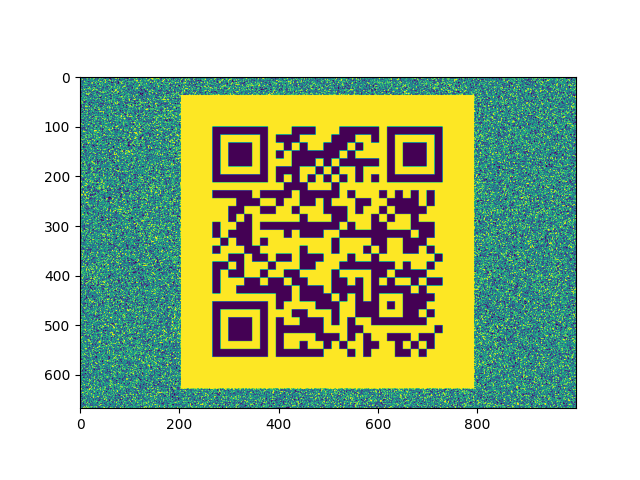

There is a picture `corgi-can-fly.png` file the task given.

And?

1. Task description mentions `Pillow` and `stegsolve`.
2. This may have something to do with keyworkds such `Misc` `Steganography`.
3. The file type is `png`, which means that the `LSB`(Least Significant Bit) will not loss.(JPG compressiong algorithmn will alawys change the pixel value )

> [Maintaining LSB through JPG compilation - is it possible? - StackOverflow](https://stackoverflow.com/questions/59880267/maintaining-lsb-through-jpg-compilation-is-it-possible)

Let's take a look into `LSB`.

How does that works?
1. `LSB` is the first bit in binary interger.
2. Each pixel in picture has its own `Color Code` likes `pixel(Red,Green,Blue)`. 
3. It's impossible for human eyes to distinguish a color which was modified in the last bit(At least for 3 bits per pixel).
4. So, with that, we can hide some information in the `LSB`.

> [Last Significant Big - WikiPedia](https://en.wikipedia.org/wiki/Bit_numbering#Bit_significance_and_indexing)

So?

Use the [`PIL` modules ](https://pillow.readthedocs.io/en/stable/) to extract hidden information from the picture.

Final script please check up at `extract.py`

 
	